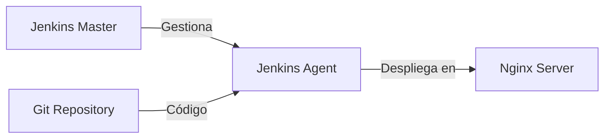

# jenkins-playground-iac | Práctica CI/CD con Jenkins

Este repositorio contiene una configuración completa para implementar un pipeline de CI/CD utilizando Jenkins, Docker y Nginx. El proyecto está diseñado con fines educativos para demostrar las mejores prácticas en integración y despliegue continuo.

## Arquitectura

El proyecto consta de tres componentes principales dockerizados:

- 🔵 **Jenkins Master**: Servidor principal de Jenkins
- 🟢 **Jenkins Agent**: Nodo de ejecución para los jobs
- 🌐 **Nginx Server**: Servidor web para el despliegue



## Requisitos Previos

- Docker y Docker Compose v2.x o superior
- Git y cuenta de github
- Acceso a puertos 8080 (Jenkins) y 80 (Nginx)

## Configuración Inicial

### 1. Clonar los Repositorios

```bash
# Clonar repositorio de infraestructura (este)
git clone https://github.com/Cloud-DevOps-Labs/jenkins-playground-iac

# Clonar repositorio de la aplicación web
https://github.com/Cloud-DevOps-Labs/jenkins-playground-app
```

### 2. Preparar el Entorno

```bash
cd jenkins-playground-iac

# Dar permisos de ejecución a los scripts de configuración
chmod +x scripts/*.sh

# Ejecutar script de configuración inicial
./scripts/initial-setup.sh
```

### 3. Iniciar los Contenedores

```bash
docker-compose up -d
```

```bash

# Configurar el agente para que tenga las dependencias
make setup-agent

```

```bash

# Configurar el servidor web para que tenga ssh
make setup-webserver

```

``` bash

# Comprueba que el agente tenga instaladas las dependencias
make agent
🔧 Accediendo al shell de Jenkins agent...

root@7dd48c7265da:/home/jenkins# npm --version
10.9.1

root@7dd48c7265da:/home/jenkins# node --version
v20.18.1

```

### 4. Configuración de Jenkins

#### 4.1 Obtener la Contraseña Inicial
```bash
docker exec jenkins-master cat /var/jenkins_home/secrets/initialAdminPassword
```

#### 4.2 Configuración Inicial de Jenkins
1. Acceder a http://localhost:8080
2. Introducir la contraseña inicial obtenida
3. Seleccionar la opción de personalizar instalación e incluir: SSH Agent
4. La creación del usuario adicional es opcional
5. Comprobar que la dirección de Jenkins es: http://localhost:8080/

#### 4.3 Configurar Credenciales en Jenkins
1. Ir a "Manage Jenkins" > "Manage Credentials" > Domains (global) > + Add Credentials
2. Añadir credenciales SSH para Jenkins Agent:
   - Kind: SSH Username with private key
   - ID: jenkins-agent-key
   - Username: jenkins
   - Private Key: [Contenido de ./ssh-keys/jenkins_agent]
   - Passphrase (dejar en blanco)

3. Añadir credenciales SSH para Webserver:
   - Kind: SSH Username with private key
   - ID: webserver-key
   - Username: root
   - Private Key: [Contenido de ./ssh-keys/webserver]
   - Passphrase (dejar en blanco)

#### 4.4 Configurar el Nodo Jenkins
1. Ir a "Manage Jenkins" > "Manage Nodes"
2. Añadir nuevo nodo:
   - Node name: jenkins-agent
   - Permanent Agent: Yes
   - Remote root directory: /home/jenkins/agent
   - Labels: jenkins-agent
   - Launch method: SSH
   - Host: jenkins-agent
   - Credentials: jenkins (desplegable)
   - Host Key Verification Strategy: Non verifying

3. Ver estadísticas del nodo: Nodes > jenkins-agent > System Information
   - Ir a la pestaña de Environment Variables
   - Comprobar que el valor de JENKINS_AGENT_SSH_PUBKEY coincide con el contenido de: [Contenido de ./ssh-keys/jenkins_agent.pub]

4. Volver al listado de agentes: Nodes
   - Refrescar la vista de tabla
   - Comprobar que el agente tiene las mismas características que el nodo coordinador (Built-In Node)


### 5. Crear el Pipeline

1. Ir a Jenkins Dashboard
2. Crear "New Item" con nombre: pipeline-web
3. Seleccionar "Pipeline"
4. Configurar pipeline:
   - Pipeline from SCM
   - SCM: Git
   - Repository URL: https://github.com/Cloud-DevOps-Labs/jenkins-playground-app.git
   - Credentals: none (no se usan las SSH porque el repositorio es público)
   - Branch to build: */main
   - Script Path: Jenkinsfile

## Verificación:

Local:

1. Podemos forzar un despliegue con Build Now/Construir ahora
2. Comprobamos los pasos realizados > Build #1
3. Vemos el resultado:
   - En Console Output las acciones del Jenkinsfile
   - En Status del resultado de la ejecución de ese pipeline

Remoto:

1. Creamos un fork del proyecto: https://github.com/<TU_USUARIO>/jenkins-playground-app
2. Ajustamos el pipeline para que apunte a nuestro fork
2. Hacer un commit en nbuestro repositorio
3. Verificar que el pipeline se ejecuta automáticamente
4. Comprobar la web desplegada en http://localhost:80


## Estructura del Proyecto

```
jenkins-cicd/
├── docker-compose.yaml     # Configuración de contenedores
├── scripts/
│   └── initial-setup.sh    # Script de configuración inicial
├── nginx-conf/             # Configuración de Nginx
│   └── default.conf
├── ssh-keys/              # Claves SSH generadas
└── README.md
```

## Consideraciones de Seguridad

- Las claves SSH se generan localmente durante la configuración inicial
- Los secretos y credenciales se gestionan a través del sistema de credenciales de Jenkins
- Se aplica el principio de mínimo privilegio en todas las configuraciones
- Las claves SSH deben rotarse periódicamente en un entorno de producción

## Solución de Problemas

### El agente Jenkins no se conecta

Verificar:

1. Las credenciales SSH están correctamente configuradas
2. El contenedor del agente está en ejecución
3. La red de Docker está funcionando correctamente

### Fallos en el despliegue web

Verificar:

1. Los permisos en el directorio web de Nginx
2. La conectividad SSH entre el agente y el servidor web
3. Los logs de Nginx para errores específicos

## Referencias

- [Jenkins Pipeline Documentation](https://www.jenkins.io/doc/book/pipeline/)
- [Docker Compose Documentation](https://docs.docker.com/compose/)
- [Jenkins SSH Agent Plugin](https://plugins.jenkins.io/ssh-agent/)
- [Nginx Documentation](https://nginx.org/en/docs/)

